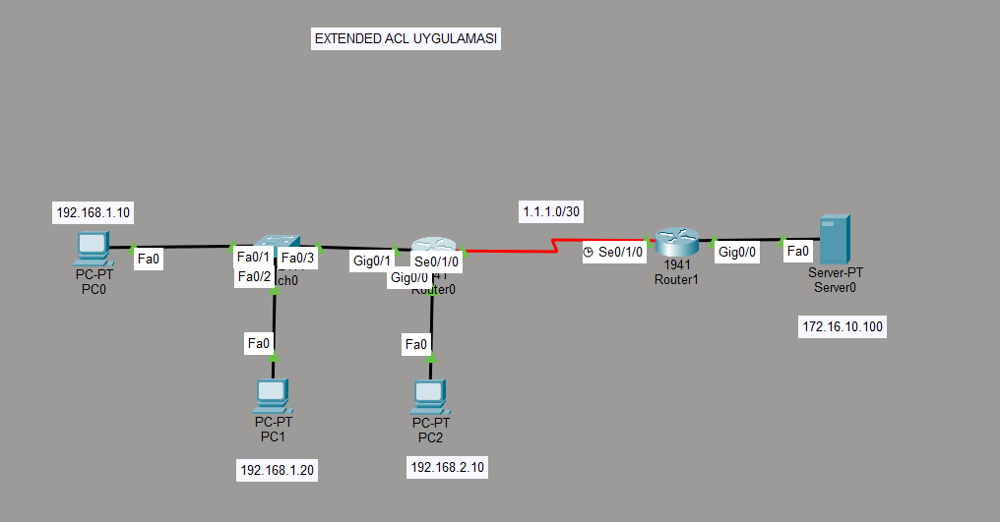
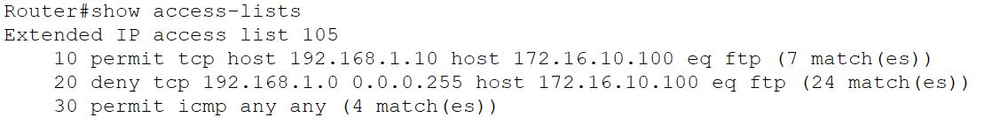

# Extended ACL Uygulaması



Bu projede Cisco Router üzerinde **Extended Access Control List (ACL)** kullanarak belirli bir istemcinin FTP erişimine izin verildi, diğer istemcilerin erişimi engellendi.

---

📌 Senaryo

Ağ topolojisinde iki router ve bir FTP server bulunmaktadır.


🖥 Topoloji Bilgileri

### Ağlar

- 192.168.1.0/24  → LAN (PC0 ve PC1)
- 192.168.2.0/24  → LAN (PC2)
- 1.1.1.0/30      → Routerlar arası bağlantı
- 172.16.10.0/24  → Server ağı


🎯 Amaç

- Sadece **192.168.1.10** adresli PC'nin
- **172.16.10.100** FTP Server'a erişebilmesi
- Aynı ağdaki diğer kullanıcıların FTP erişiminin engellenmesi

---

🛠 Kullanılan Extended ACL

Extended ACL kaynak ağa en yakın router üzerinde oluşturulmuştur.(router0)

### ACL Tanımı

```bash
no access-list 105

access-list 105 permit tcp host 192.168.1.10 host 172.16.10.100 eq 21
access-list 105 deny tcp 192.168.1.0 0.0.0.255 host 172.16.10.100 eq 21
access-list 105 permit icmp any any

🔌 ACL'nin Interface'e Uygulanması

Extended ACL kaynak ağa en yakın yerde uygulanmalıdır.

192.168.1.0 ağı Router0 üzerindeki GigabitEthernet0/1 interfaceine bağlıdır.

interface gigabitEthernet0/1
ip access-group 105 in

Sonuç
Kaynak IP	FTP Erişimi
192.168.1.10	✅ İzinli
192.168.1.20	❌ Engelli
192.168.2.10	✅ Serbest

Öğrenilen Konular

-> Extended ACL mantığı
-> Wildcard mask kullanımı
-> ACL sıralama mantığı (Top-down logic)
-> Interface'e ACL uygulama
-> FTP port davranışı

🔐 Güvenlik Notu

FTP kontrol bağlantısı TCP port 21 üzerinden çalışır.
Extended ACL ile belirli bir kaynaktan gelen FTP trafiği filtrelenmiştir.

---

🧠 Teknik Kazanım

Bu çalışma sayesinde:

- Network güvenliği temel prensipleri
- Router üzerinde trafik filtreleme
- Extended ACL tasarımı ve uygulaması
- Gerçek senaryoya uygun erişim kontrolü

uygulanmıştır.

---

🔍 Verification

ACL çalışmasının doğrulanması için aşağıdaki komut kullanılmıştır:

```bash
show access-lists

Çıktı

Extended IP access list 105
    10 permit tcp host 192.168.1.10 host 172.16.10.100 eq ftp (7 match(es))
    20 deny tcp 192.168.1.0 0.0.0.255 host 172.16.10.100 eq ftp (24 match(es))
    30 permit icmp any any (4 match(es))

```markdown

### Screenshot


Açıklama

7 matches → 192.168.1.10 adresinden gelen FTP trafiği başarılı
24 matches → Diğer istemcilerin FTP denemeleri engellenmiş
4 matches → ICMP trafiği izinli


🚀 Kullanılan Araç

- Cisco Packet Tracer


